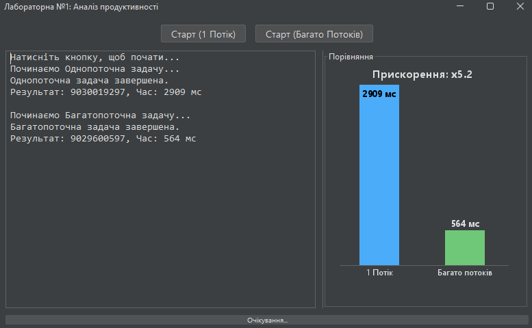

# Лабораторна робота №1: Аналіз продуктивності багатопоточності

## 🧑‍💻 Виконавець

* **Студент:** Литвиненко Дмитро Сергійович
* **Група:** I-23 (4-й курс)
* **Університет:** Міжнародний науково-технічний університет імені академіка Юрія Бугая

---

## 📊 Про проєкт

Це десктопний Java-додаток, створений для візуального аналізу та порівняння продуктивності однопоточного та багатопоточного виконання обчислювальної задачі.

Програма використовує `ExecutorService` для керування пулом потоків та `SwingWorker` для асинхронного оновлення GUI, щоб уникнути "зависання" інтерфейсу. Стиль реалізовано за допомогою сучасної бібліотеки **FlatLaf (Darcula)**.

### 🎯 Фінальний результат

Графік наочно демонструє різницю у часі виконання та автоматично розраховує **"Прискорення" (Speedup)** — у скільки разів багатопоточний підхід виявився ефективнішим.



---

## 🚀 Як запустити

Цей проєкт запаковано як `app-image`, який **вже містить у собі Java**. Вам не потрібно нічого встановлювати додатково.

1.  Перейдіть у вкладку **[Releases](https://github.com/Lutvunenko-Dmutro/java-thread-performance-analyzer/releases/tag/v1.0)**.
2.  Завантажте файл **`ModernLab.zip`** зі списку "Assets".
3.  **Розархівуйте** цей `.zip` файл (наприклад, на Робочий стіл).
4.  Відкрийте нову папку `ModernLab` і двічі клікніть на **`ModernLab.exe`**.

### 🛠️ Збірка з вихідного коду

Якщо ви хочете зібрати проєкт самостійно:

1.  Клонуйте репозиторій.
2.  Переконайтеся, що у вас є `JDK 25`.
3.  Завантажте бібліотеку [flatlaf-3.6.2.jar](https://www.google.com/url?sa=E&source=gmail&q=https://repo1.maven.org/maven2/com/formdev/flatlaf/3.6.2/flatlaf-3.6.2.jar&authuser=1) у папку з кодом.
4.  Скомпілюйте:
    ```powershell
    javac -cp ".;flatlaf-3.6.2.jar" ModernGUI.java
    ```
5.  Запустіть:
    ```powershell
    java -cp ".;flatlaf-3.6.2.jar" ModernGUI
    ```

-----

## 🛠️ Стек технологій

  * **Мова:** Java (JDK 25)
  * **GUI:** Java Swing
  * **Багатопоточність:** `ExecutorService`, `Callable`, `SwingWorker`
  * **Стиль (Look & Feel):** [FlatLaf (Darcula)](https://www.formdev.com/flatlaf/)
  * **Збірка:** `jar` (Uber-JAR)
